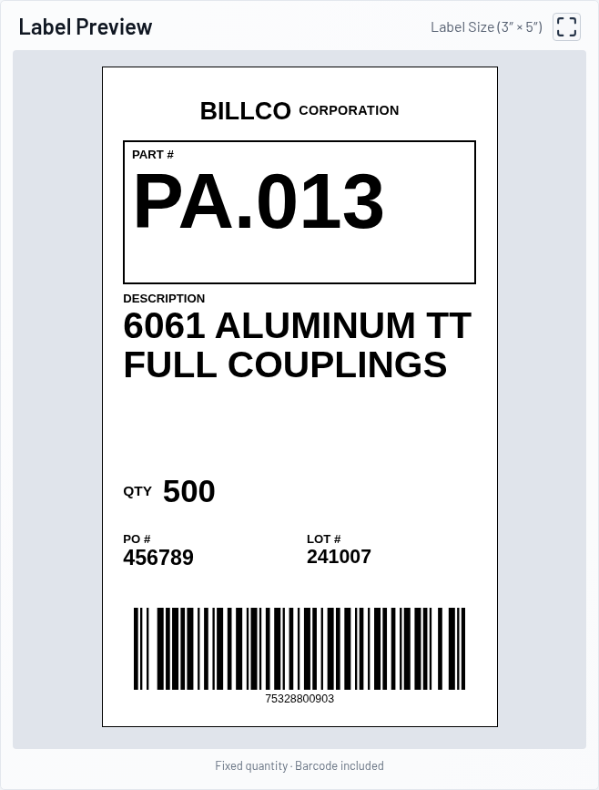
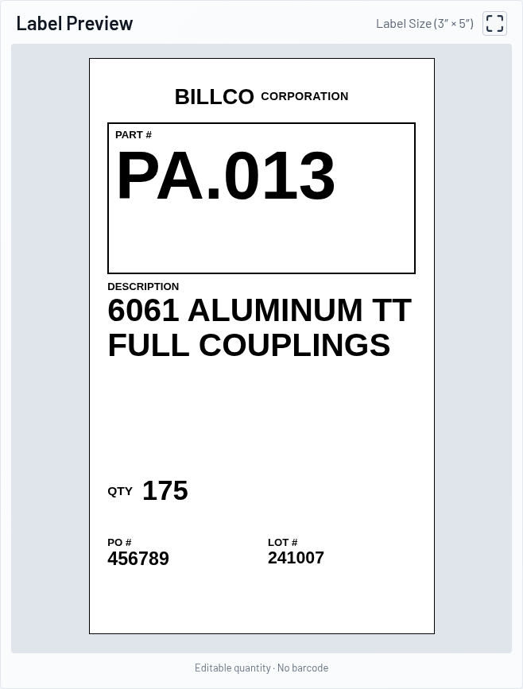
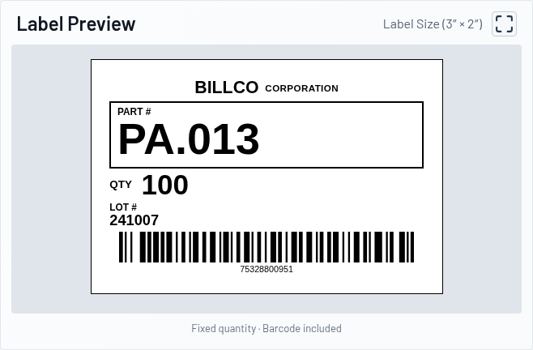
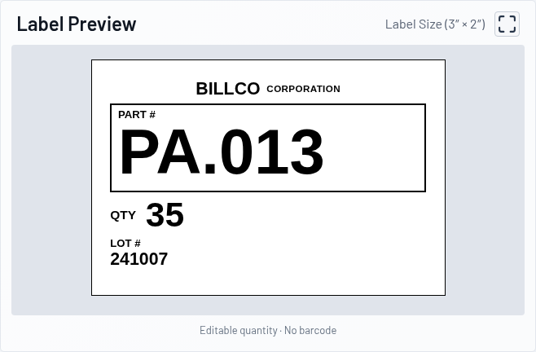

# Billco thermal label previews

The Product Labels page renders imported SQLite product records as black ink
on white label stock. This feature renders previews only. Printing, SATO
integration, PDF generation, customer labels, pallet placards, and Will Call
labels are outside scope.

| Type | Size | Quantity | Barcode | Additional fields |
| --- | --- | --- | --- | --- |
| Bulk Fixed | 3 × 5 inches | Bulk Fixed Quantity, locked | Bulk Barcode | Description, PO, lot |
| Bulk Variable | 3 × 5 inches | Operator entry | None | Description, PO, lot |
| Package Fixed | 3 × 2 inches | Package Fixed Quantity, locked | Product Barcode | Lot |
| BCC | 3 × 2 inches | Operator entry | None | Lot |

Every label shows flat BILLCO CORPORATION branding and a boxed Part Number.
Part Number is the largest text; description is the next priority on bulk
labels, followed by quantity, PO, lot, and barcode. Compact labels emphasize
Part Number, then quantity, lot, and barcode. Upright Arial/Helvetica typography,
square edges, and high contrast resemble industrial thermal output.

Product Barcode and Bulk Barcode are separate imported values. Fixed previews
encode their matching value as Code 128B and display that value below the bars.
Neither barcode is generated from Part Number or copied from the other field.
Variable quantities never display a barcode. Missing bulk quantity or barcode
disables only Bulk Fixed; it does not make the product unavailable for the
other label types. Package Fixed requires its own package quantity and code.

## Live behavior

Changing a Part Number immediately clears the previous preview and starts an
automatic lookup after a 300 ms pause. Search and Enter still trigger an
immediate lookup. Clear, further edits, and leaving the page cancel pending
lookups; old responses cannot restore the previous product.

Label type, operator quantity, PO, and lot edits update the preview immediately.
Changing to Bulk Variable or BCC clears quantity for operator entry. Invalid
quantities show a dash and an instruction to enter a whole number from 1 to
999999. Fixed quantities remain locked. Unknown and inactive products cannot
render labels.

The normal and expanded views use `src/components/ProductLabel.tsx`. Width is
consistent across label types; height follows the 3:5 or 3:2 aspect ratio. The
size caption indicates intended stock dimensions. Screen scaling does not
calibrate physical inches or certify printer output or barcode scanability.

Complete imported identifiers and descriptions are preserved. Text fitting
responds to content, available space, and viewport changes without ellipses.
Very long values use smaller text to fit, and the remaining fields scale to
keep Part Number dominant; the application's existing data length limits apply.

## Screenshots

These captures use part `PA.013` imported through BillcoMaster from the supplied
production workbook. Bulk Fixed uses quantity 500 and Bulk Barcode 75328800903;
Package Fixed uses quantity 100 and Product Barcode 75328800951. Bulk Variable
and BCC use example operator quantities 175 and 35 respectively.

| Bulk Fixed · 3×5 | Bulk Variable · 3×5 |
| --- | --- |
|  |  |

| Package Fixed · 3×2 | BCC · 3×2 |
| --- | --- |
|  |  |
